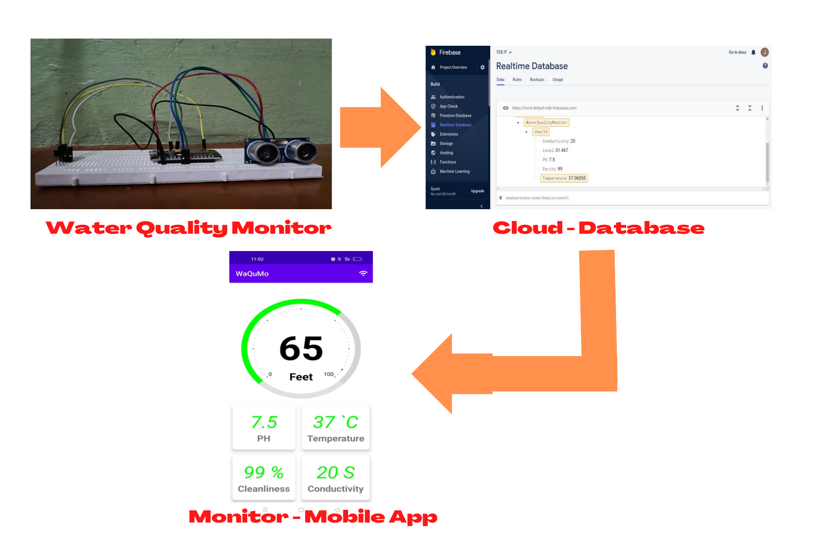
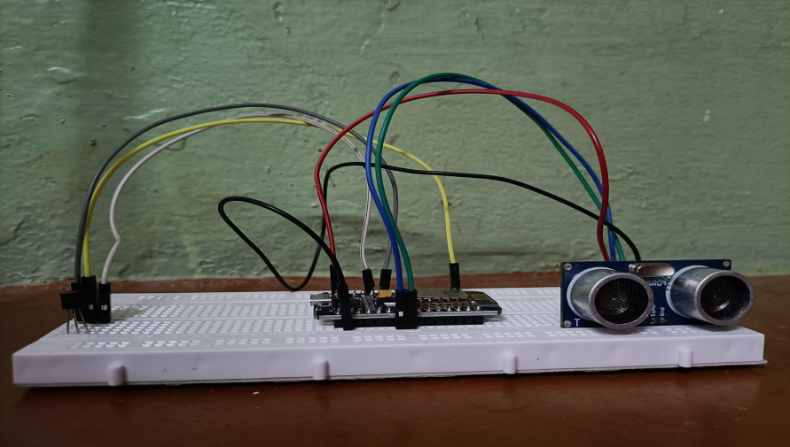
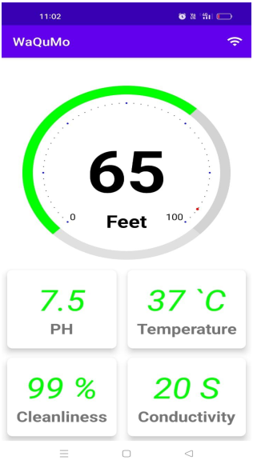

# WATER QUALITY MONITOR (IN HOME)
Water resources play important roles in the creation of the
world. Nowadays, the water we use for both drinking and domestic
purposes isn’t a hygiene one and quality also seems bad. It is difficult
to monitor water by going to the roof of the home to check the water
tank for water purity and also can’t be done completely. So, a problem
arises on verifying water purity and its quality management.

## Implementation

### Tools
<h3 style="font-size: 50px;">&raquo;  Hardware</h3>
<ul>
  <li><b>Ph Sensor</b> - Calculate Ph of water</li>
  <li><b>Temperature Sensor</b> - Calculate Temperature of water</li>
  <li><b>Ultrasonic Sensors</b> - Calculate Flow and Level of Dam</li>
  <li><b>Arduino</b> - Collects all data and send to transmiter</li>
  <li><b>Node MCU</b> - Sends the data to the Database</li>
</ul>

<h3 style="font-size: 50px;">&raquo;  Software</h3>
<ul>
  <li><b>Arduino IDE</b> - Designing and Creating Webpages</li>
  <li><b>Android Studio</b> - Hosting the Webpages</li>
  <li><b>Firebase</b> - Real Time Database</li>
</ul>

## Prototype
 

  
  
 

 
## About Us
This project was done by <b>JagaGanesh D</b>, <b>Eshwaran</b>, <b>Lokkeswaran S</b> and <b>Velmurugan M</b>. We are students of IT Department from Thiagarajar College of Engineering, Madurai. This project inspired by Mobile Application Development and Internet of Things the courses belongs to Third Year Sixth Semester of IT department (January 2022 - May 2022).
