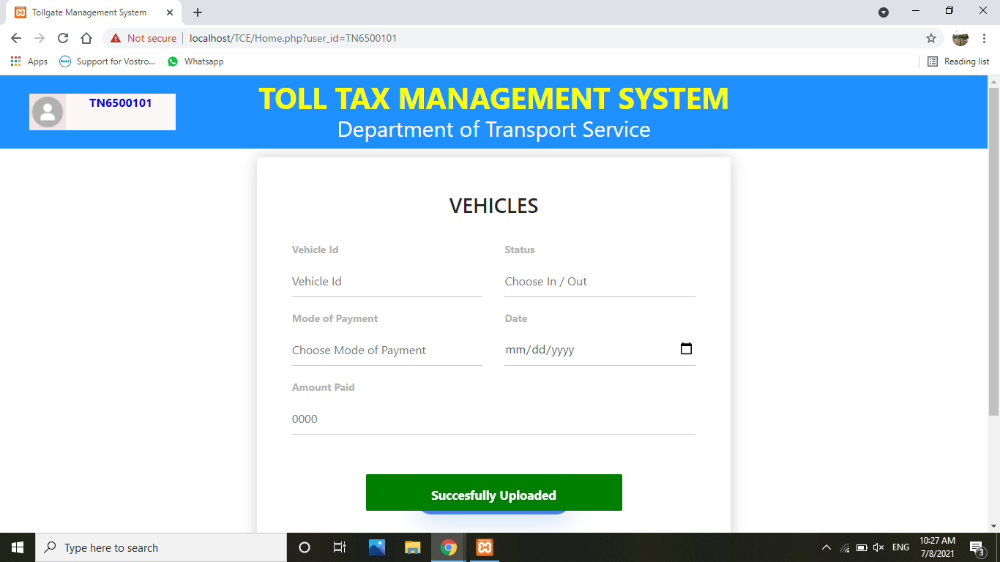

# TollGate Management System
Our Application is Toll Gate Management System. This Application can provide all the information related to Toll booth and the passenger checks in online and pays the amount,with the help of android application or Web Application the system through bluetooth ,then verify the identity of the user and then the vehicle. After the verification the system will automatically open the toll gate.

## Implementation
<ul>
  <b>1. Install Oracle Database 19c and create tables and rows with respect to the Tollgate management system.</b> 
  <b>2. Install Oracle Instant Client 19 and set the path respectively to access data from database to server.</b> 
  <b>3. Install Xampp Server to perform localhost server.</b> 
  <b>4. Connect Xampp Apache php configuration to Oracle Instant Client 19.</b> 
  <b>5. Design Website using html, css, javascript and php with accessing the database.</b> 
  <b>6. Start working with TollGate Management System.</b>
</ul>

## Working
<ul type="square">
  <li>About Us Page</li>
  The About us page describes the mini project briefly and mentions the developers of the project.
  

  
  <li>Index / Login Page</li>
  
  <li>Home / Vehicles entry Page</li>
</ul>

## About Us
This project was done by <b>JagaGanesh D</b>, <b>Lokkeswaran S</b> and <b>Velmurugan M</b>. We are students of IT Department from Thiagarajar College of Engineering, Madurai. This project inspired by Database Management System the course belongs to Second Year Fourt Semester of IT department (January 2021 - May 2021).
